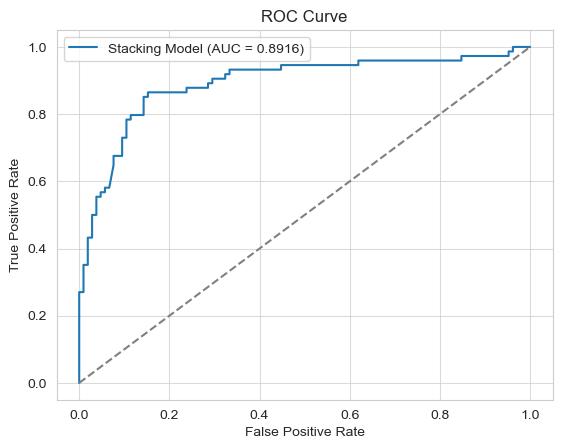
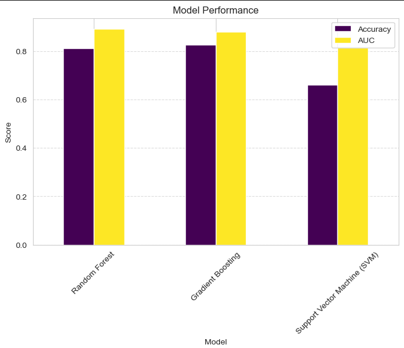
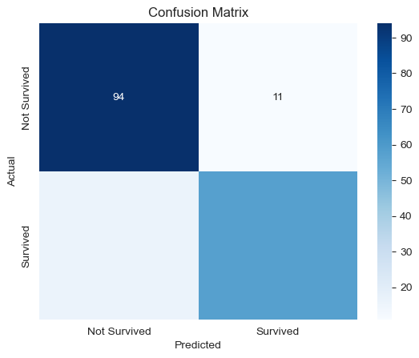

# Titanic_EDA_to_ML

This project analyzes the famous Titanic dataset to predict passenger survival using various machine learning algorithms. It includes data exploration, preprocessing, and model evaluation techniques.

## Table of Contents
1. [Overview](#overview)
2. [Dataset](#dataset)
3. [Project Features](#project-features)
4. [Machine Learning Models](#machine-learning-models)
5. [Technologies Used](#Technologies-Used)
6. [Results](#results)

  ## Dataset
The Titanic dataset is sourced from [Kaggle](https://www.kaggle.com/datasets/yasserh/titanic-dataset). It includes information about passengers such as age, gender, and ticket class, with the goal of predicting survival.

- **Number of rows**: 891
- **Features**: 11
- **Target**: `Survived` (0 = No, 1 = Yes)

## Project Features
- Data cleaning and preprocessing (handling missing values, encoding categorical variables).
- Feature engineering and scaling.
- Comparison of multiple machine learning models:
  - Logistic Regression
  - Random Forest
  - Gradient Boosting
  - Support Vector Machine
- Model evaluation using metrics like accuracy, ROC-AUC, and confusion matrices.
- Advanced techniques: stacking models and hyperparameter tuning.

## Model Performance
| Model                     | Accuracy | ROC-AUC |
|---------------------------|----------|---------|
| Random Forest             | 0.81     | 0.89    |
| Gradient Boosting         | 0.83     | 0.88    |
| Support Vector Machine    | 0.66     | 0.81    |

### Visualization
Below is a bar chart illustrating the Accuracy and AUC of the models:

## Technologies Used
- **Programming Language**: Python
- **Libraries**: pandas, numpy, scikit-learn, matplotlib, seaborn
- **Visualization Tools**: Matplotlib, Seaborn
- **IDE**: Jupyter Notebook

## Results
The Random Forest model achieved the highest AUC score of **0.89**, outperforming other models.

### Key Visualizations

